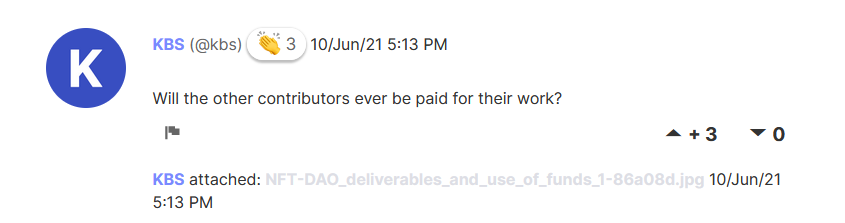
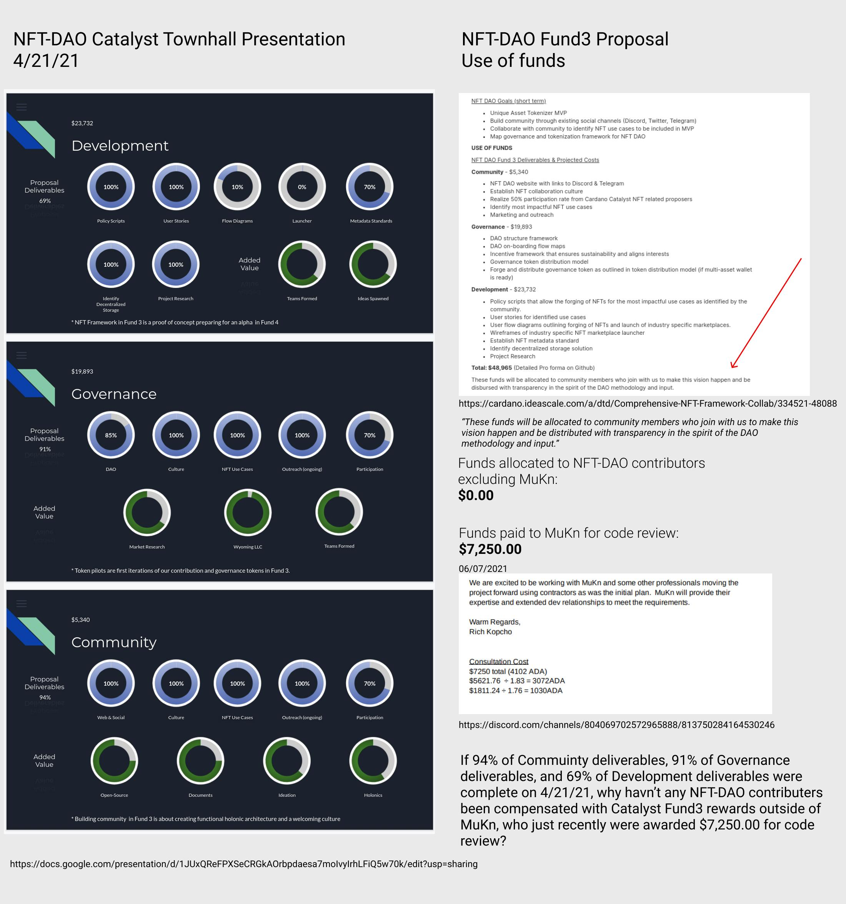

# Ideascale Comments

## 10th June 2021

### Will the other contributors ever be paid for their work?

## 11th June 2021

### Yes, thanks for the opportunity to explain our reasoning and timing, once all the funding is received.

NFT-DAO \(the whole team\) \(@nftdao\) kudos icon + 11/Jun/21 5:17 PM

Team Member

Yes, thanks for the opportunity to explain our reasoning and timing, once all the funding is received.

As the Fund-3 proposal states: "These funds will be allocated to community members who join with us to make this vision happen and be disbursed with transparency in the spirit of the DAO methodology and input."

Our wallet address is public: addr1qyd2t7r0na47eq08fjfjh29alqxlmqmrml2ulexw3xdx5d8zaagj3n6myd2jwdsgsa9778hwyer3sa6r9y6dtmuux0nssxherd

1\) Not all the funds from Catalyst have been received so they simply aren't available to disburse.

2\) The project is not complete. Thus, it isn't possible to fairly disburse funds until we can measure all the contributions, and the governance team is still working on a fair assessment model as well.

3\) The community is entrusting us to use their money to deliver the expected Return on Intention. That doesn't mean just any work gets rewarded, it means the work done "to make this vision happen" as you pointed out.

Our Contract with the community is an opportunity to contribute to an open-source project as the proposal states:

"Community Member n+1, ….individuals who could potentially pool their expertise into an all-embracing open-source version to benefit the entire community rather than one project. Their expertise is multivariate in development, SPO, marketing, design, business, and more." —The proposal states it is "open-source" 10 times.

However, above and beyond open-source models that typically aren't paid gigs, we allocated and will disburse funds to those "who join with us to make this vision happen".

As far as our Contract with Mutual Knowledge, it is a paid contractor arrangement. And the best thing that has happened in development. They concluded:

"The failure to build Akkadia to any master plan is a critical flaw in the code. It resulted in significant wasted effort in the form of components that do not connect to each other, crucial functionality never being built, and left no easy way to integrate the code components that were built. For these reasons, we believe the most cost-effective option for NFT DAO is to design and build Akkadia from scratch."

Should we pay for those contributions?

Now we have professionals with a plan and are making rapid progress to recover lost time. Had we paid these contributors already, we would have wasted money, would that be fiscally responsible?

Once we complete the MVP of Fund-3 and we can assess fairly all "community members who join with us to make this vision happen", we will disburse the funds accordingly.

About You: This kbs account just joined Ideascale today and specifically targeted all our F4/5 proposals below with similar comments. It appears you are disgruntled and feel something is owed you. I hardly believe I will be able to find a comment from your alias on any other proposal. It seems you lack the courage, transparency, honesty and the integrity to reveal your true identity.

I believe our Catalyst community will see your attempt to discredit these proposals for exactly what it is. Even so, our door is open, and anyone can come and go as they please, feel free to DM me if you want to resolve your angst.

--Rich Kopcho, Proposer F3 Comprehensive NFT Framework Collab

NFT-DAO-NFT-metadata-standards

Will the other contributors ever be paid for their work?

NFT-DAO-EZ-on

Will the other contributors ever be paid for their work?

NFT-DAO-EZ-Pay-API-wallet-connector

Will the other contributors ever be paid for their work?

NFT-DAO-EZ-On-Interop-NFTs

Will the other contributors ever be paid for their work?

NFT-DAO-EZ-Ticket-dispenser

Will the other contributors ever be paid for their work?

NFT-DAO-EZ-Name

Will the other contributors ever be paid?

NFT-DAO-EZ-Honor-contribution-token

Why haven't any of the contributors been paid by the NFT-DAO?

